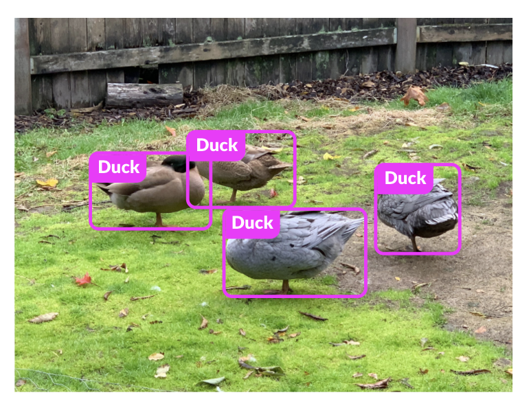
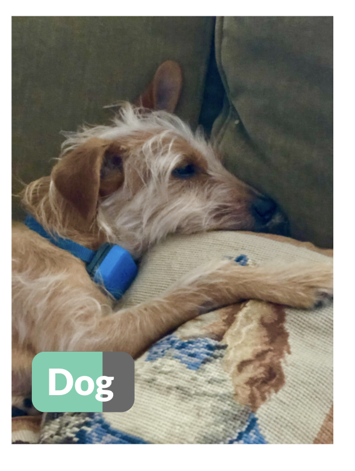
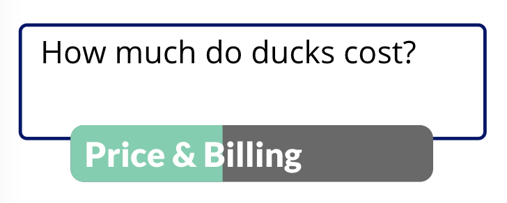
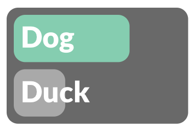
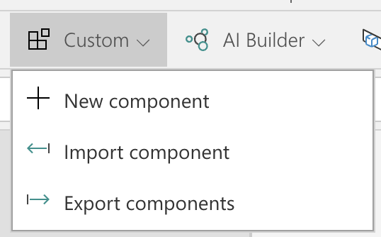
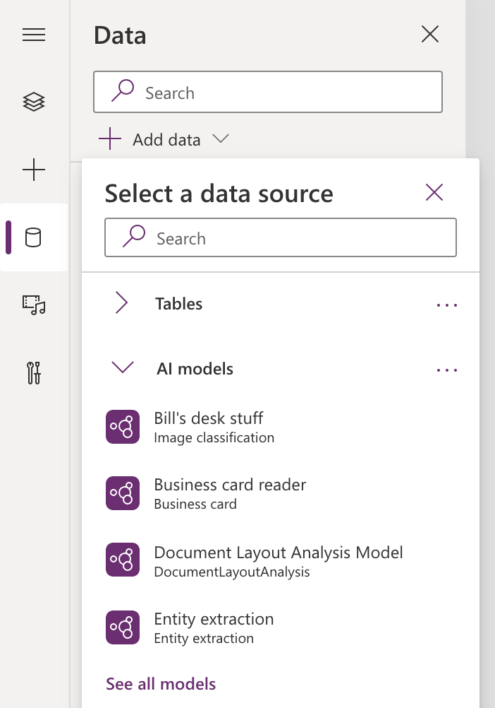
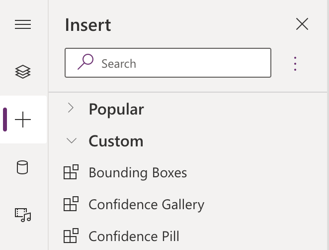
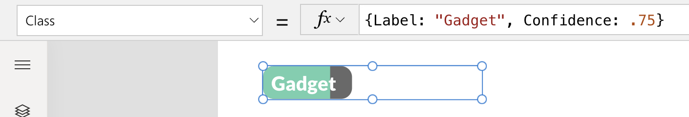
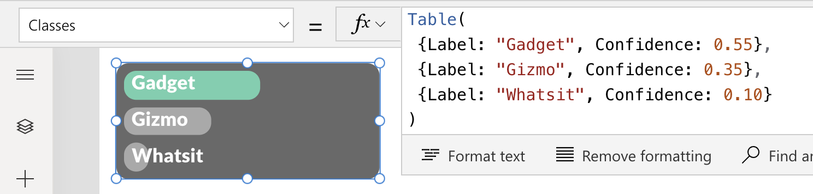
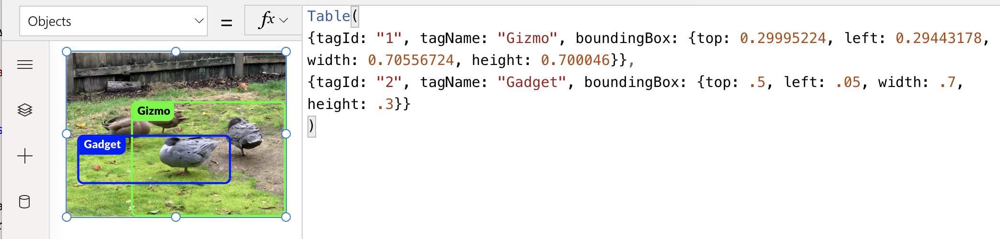

# Custom AI Components for Power Apps

 

Sample custom components that demonstrate how to visualize results from AI models in Power Apps via AI Builder and Power Fx. Open sourced under [MIT License](./LICENSE). Not officially supported by Microsoft.

## Table of Contents

### [What you'll need](#what-youll-need)
### [Getting started](#getting-started)
### [The Confidence Pill component](#the-confidence-pill-component)
### [The Confidence Gallery component](#the-confidence-gallery-component)
### [The Bounding Boxes component](#bounding-boxes)
### [Using the camera](#using-the-camera)
### [Building your own custom components](#building-your-own-custom-components)
### [Stay in touch](#stay-in-touch)

## What you'll need

* A **Power Apps license** -- you may already have one via your organization, and if not you can get one for free [here](https://powerapps.microsoft.com/developerplan/).
* **Chrome or Edge**. While Power Apps can be run on a broad range of browsers (not to mention iOS, Android, and Windows apps) building them requires [Chrome](https://www.google.com/chrome/) or [Edge](https://www.microsoft.com/edge).
* If you want to try these components with computer vision models you'll need, well, **computer vision models**. You can build [object detection](https://docs.microsoft.com/en-us/ai-builder/get-started-with-object-detection) models in AI Builder (which is part of Power Apps) and [image classification](https://www.lobe.ai/docs/welcome/welcome) models in [Lobe](https://lobe.ai) (a Windows and Mac app from Microsoft which is free to download and use), or someone in your organization may already have built some and made them available to you.
* AI is a premium feature of Power Apps and many (but not all) AI features require **AI credits**. Most Power Apps licenses include starter capacity of AI credits for exactly this kind of experimentation. You may also qualify for a free 30-day trial. And certain model types (including, currently, image classification) are free to use.

## Getting started

1. Download `AI-Components.msapp` from this repo by going [here](./AI-Components.msapp) and selecting "Download"
2. Edit or create a Power App and import the `AI-Components.msapp` file you just downloaded into your Power App using the `Insert`/`Custom` menu
 
3. Add one or more AI models into your Power App using the `Data` pane. The `AI models` section will show all the models that you have access to, including a variety of prebuilt models.
 
4. Add one or more of the components to your app using the `Insert` pane
 
5. Configure your components as detailed below

## The *Confidence Pill* component

A number of AI model types return a class and a confidence. You could just show this as text, e.g. `Duck (85%)` but Lobe adopts a more intuitive visual approach that we can leverage in Power Apps.

Add the `Confidence Pill` component as shown in [step 4 above](#getting-started). You should see something like this:

The `Class` property is a record containing the class name and confidence to display. The default value of `{Label: "Gadget", Confidence: .75}` is a great way to experiment with the display options. Try changing the `Label` and the `Confidence` fields to get a feel for how the display logic works.

You can move and resize the component however you like. There are properties for the font, text color, pill colors, pill radius, and text padding (which allows you to fine tune the relationship between the font and the calculated pill width) properties, but if you're happy with the defaults you can leave them alone. Note that the `PillFill` and `ConfidenceFill` values are expecting CSS color values such as `"#67D0AE"` and `"DimGray"`.

As you may have noticed, nothing about this components cries out "Artificial Intelligence". In fact it is intentionally very *un*intelligent, and only know how to render the data you pass in. This can be very useful! Perhaps you have built a workflow using Power Automate that runs every time a user posts to a Teams channel, or adds an image to a SharePoint site, which runs an AI model and stores the results in a database. In this case your Power App only needs to show those results.

But sometimes the AI models are run in the app itself, and it's easy to hook up this components to make this happen. Let's try this out.

We'll start with some *text classification*. You'll need to add a text classification model as shown in [step 3 above](#getting-started). AI Builder conveniently provides a prebuilt model called `Category classification`.

Now add a `Text Input` control called `TextInput1`, and set its `OnChange` property to `Set(textClasses, 'Category classification'.Predict("en", TextInput1.Text).results)` (feel free change `"en"` to your language of choice). Every time a user updates the text your app will run the model against the text and store the results in a global variable called `textClasses`.

Now set the `Class` of your confidence pill component to `{Label: First(textClasses.type).type, Confidence: First(textClasses.score).score}`. This expression maps the top values from the `type` and `score` fields of `textClasses` to the `Class` and `Confidence` fields this component is expecting.

Now let's try this component with *image classification*. AI Builder doesn't currently provide a prebuilt image classification model, so you'll have to build your own using [Lobe](https://lobe.ai) or hope someone in your organization has already built one that you can use. My family has one dog and nine ducks and so I created a model called `Dog vs Duck`.

Add your model as shown in [step 3 above](#getting-started), and then add an `Image` control called `ClassImage1`. Set its `Image` property to an image file that is relevant to your model. I used a picture of our dog Grover.

Now add a second `Confidence Pill` component (be a little fancy like Lobe and position it over the bottom left of your image). Set its `Class` property to `First('Dog vs Duck'.Predict(ClassImage1.Image).Labels)`, using your model name instead. Et voila!

The confidence pill will update whenever the image changes.

##  The *Confidence Gallery* component

The `Confidence Gallary` component is similar to the confidence pill but it shows multiple results. This can be helpful in communicating to users that AI models are ultimately just making an educated guess, and is particularly valuable for models where the confidence value of the first few results could be similar.

Add a `Confidence Gallery` component.

The `Classes` property is similar to the `Class` property of the confidence pill, but instead of a single record we provide a table of records. Try adding and subtracting records to the table to see what happens. By convention the confidences are in descending order and add up to 1 but neither is enforced by this component.

This component has similar properties as the confidence pill. All the *color* and *fill* properties expect CSS color values.

Now set its `Class` property to `'Dog vs Duck'.Predict(ClassImage1.Image).Labels`, using your model name instead. You can see that, to my model, Grover could be mistaken for a duck in the right light (please don't tell him).

The confidence gallery will update whenever the image changes.

In theory this component could also be used for text classification models. Unfortunately at present the output of AI Builder text classification models is in a different enough format that the same component can't easily be made to work with both. Adapting the confidence gallery for text classification models is an exercise left for the reader.

## The *Bounding Boxes* component

A different flavor of computer vision called *object detection* can detect multiple objects within an image, each with a label and bounding box. For instance you could identify both a dog and a duck in a photo or multiple ducks. This calls for a different visualization.

First add a new `Image` called `DetectImage1`, set its `Image` property to the image of your choice, and resize it so that its outline is the exact size and shape of your image. Then add a `Bounding Boxes` component and position it so that it exactly overlays the image.

The `Objects` property takes a table of records, each with a `tagName`, `tagId` (an identifier for each object, currently ignored by this component), and `boundingBox`, itself a record consisting of `top`, `left`, `height`, and `width`, each a value between 0 and 1. Try changing the tag name and dimensions for each object to match the objects in your image, adding or subtracting objects as necessary.

Note that if you use a name other than `"Gadget"` or `"Gizmo"` it will show a magenta bounding box with white text. That's because the component doesn't know which colors to use, so it uses the colors specified in the `Default Colors` property. Try changing the colors in this property.

To tell the component what colors to use for each name, change the `Colors` property, which is a table of color values.

There are also several other properties that let you adjust how the component is displayed, but if you are happy with the defaults you can leave them alone.

Now let's try this component with AI. AI Builder doesn't currently provide a prebuilt object detection model, so you'll have to build your own using AI Builder or hope someone in your organization has already built one that you can use. Using the same dataset I used for my `Dogs vs Ducks` image classification model in Lobe, I created an object detection model called `Dogs and Ducks` in AI Builder.

Add your model as shown in [step] 2 above]](#getting-started), then set the `Objects` property of your bounding boxes component to `'Dogs and Ducks'.Predict(DetectImage1.Image).results`, using your model name instead. 

The bounding boxes will update whenever the image changes.

## Using the camera

Images can come from databases or user uploads, but Power Apps also lets you access your device's camera, letting you classify or detect objects around you.

Add a `Camera` control and set its `OnSelect` property to `Set(frame, Self.Photo)`. Now in one or both of your images set the `Image` property to `frame`. Whenever you click on the camera (alt-click while you're in Studio) the image will be updated to what the camera was showing in that moment, and after the AI model runs your custom components will update with its results.

Another way to use the camera control is to regularly stream images from the camera. **Be aware that if you adopt this approach you may run through AI credits at an accelerated rate.** First, set the `Stream rate` of your camera control to `5000`. This value is in milliseconds, which means you will get a new image every 5 seconds. You can adjust this up or down, but vision AI models can take a few seconds to run, so there is a limit to how frequently you can usefully update the image. Next, set the `OnStream` property to `Set(frame, Self.Photo)`. You should see your image control(s) update at the rate you set, and the component will update after that. **Again, be aware that you may be charged AI credits for each image run through the AI model** so you will probably want to add application logic to turn the streaming on and off, especially when developing your app.

Another approach to streaming would be to place your classification or bounding boxes component directly over the camera itself. This is more space-efficient but you run the risk of confusing or misleading users because the results of the AI model will often lag behind what the camera is currently showing. This is why I prefer the live camera + captured image pattern.

Selection and streaming can be used separately or together. For instance you can automatically stream a new image every minute, but also let the user click on the camera whenever they see something interesting.

## Building your own custom components

Feel free to use any or all of these components in your apps, with the understanding that they are not officially supported by Microsoft. You can also modify and/or redistribute them as you see fit, subject to the [MIT license](./LICENSE). Finally, I strongly encourage you to build your own components using these as inspiration. If you do, I further encourage you to share them with the Power Apps community on GitHub!

Power Apps lets you examine custom components to see how they were implemented. You will see that these rely heavily on the `HTML Text` control. That's because each uses CSS features that Power Apps controls do not natively support, such as rounded rectangles. The `HtmlText` property programatically generates HTML code using the `Concat` and `Concatenate` Power Fx functions, among others. Going from Power Apps data structures to HTML is imperfect, which is why most colors are specified using CSS color values rather than native Power Apps colors.

## Stay in touch

Please file an issue or [email me](mailto:billba@microsoft.com) to let me know if these components meet your needs or not. The Power Apps team would love to know what you're doing (or would like to do) with AI, and what new capabilities would make your goals easier to achieve!
